# Rcalculator

Rcalculator is a tool created to help users easily calculate their mining power based on the NFT crypto project [RPLANET](https://rplanet.io), they can also check to the current value of all the elements 

Before this was created, there was no easy way to calculate your earnings per daily, weekly and monthly, so I created this handy tool to do all the work for you!

# Table of contents

## Table of Contents
* [User Experience Design (UX)](#User-Experience-Design)
    * [The Strategy Plane](#The-Strategy-Plane)
    * [Site Goals](#Site-Goals)
    * [User stories](#User-Stories)
    * [Wireframes](#Wireframes)
* [The Surface Plane](#The-surface-plane)
    * [Design](#Design)
    * [Colour scheme](#Colour-scheme)
    * [Typography](#Typography)
    * [Imagery](#Imagery)
* [Features](#Features)
    * [Currencies](#Currencies)
    * [Tools & Live prices](#Tools&live-prices)
* [Technologies](#Technologies)
* [Testing](#Testing)
* [Deployment](#Deployment)
    * [Run locally](#Run-locally)
    * [Github pages](#Github-pages)
* [Credits](#Credits)
    * [Acknowledgements](#Acknowledgements)

# User Experience Design (UX)

## The Strategy Plane

The world of Non fungible tokens or NFTs is becoming increasingly popular by the day, inface they're the hottest topic in the crypto world right now! As a follower of the [RPLANET](https://rplanet.io) project, I found it very tedious to have to manually calculate my earnings, that's where **Rcalculator** comes in.

**Rcalculator** was created for the NFT game [RPLANET](https://rplanet.io) with the aim of delivering a simplified tool that will calculate and display how much **AEHTER** per hour users are mining and convert it into other currencies such as **WAX** & **USDT**. **Rcalculator** has been created to also provide a list of all the elements but with an added feature, this being the **elemental tool** automatically calculated the price of each individual element and converts the price in **AETHER** to **WAX** & **USDT** so users can easily see how much the converted price costs.

## Site goals
* Give users an easy-to-use calculation tool for their **AETHER** mining power
* Help users keep track of their crypto earnings
* Help users easily see the price of elements in other currency formats

## User stories
* As a user, I want the main purpose of the site to be clear so that I immediately know what the is intended for upon entering.
* As a user, I want the website to be responsive so that I can use other devices and have no issues
* As a user I want to be able to navigate around the website with ease so that I can view content/manipulate content
* As a user I want to be able to search and filter elements 
* As a user I want to be able to see a live price feed of the currencies 

## Wireframes

#### Splashscreen

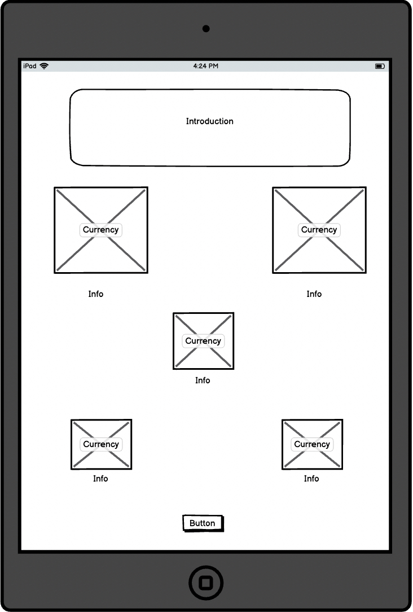
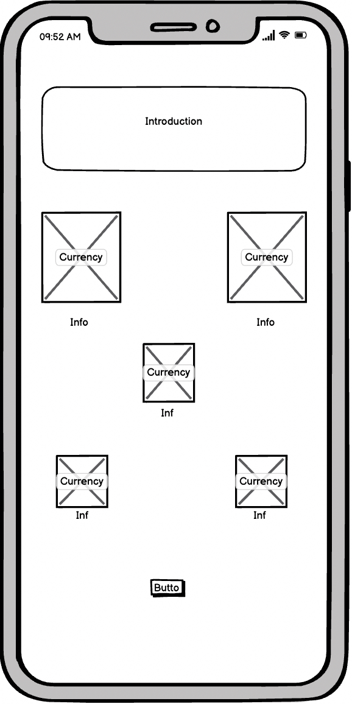

### Homepage

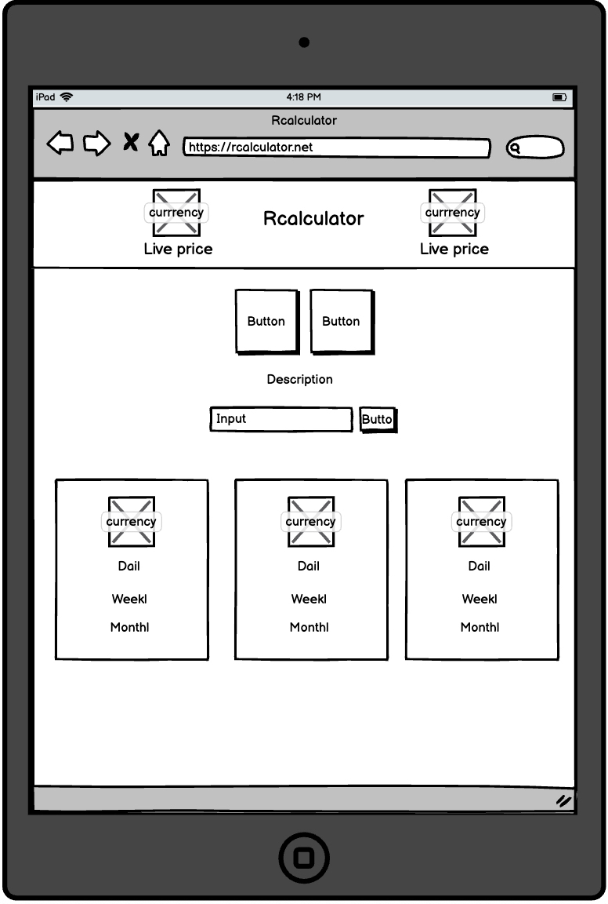
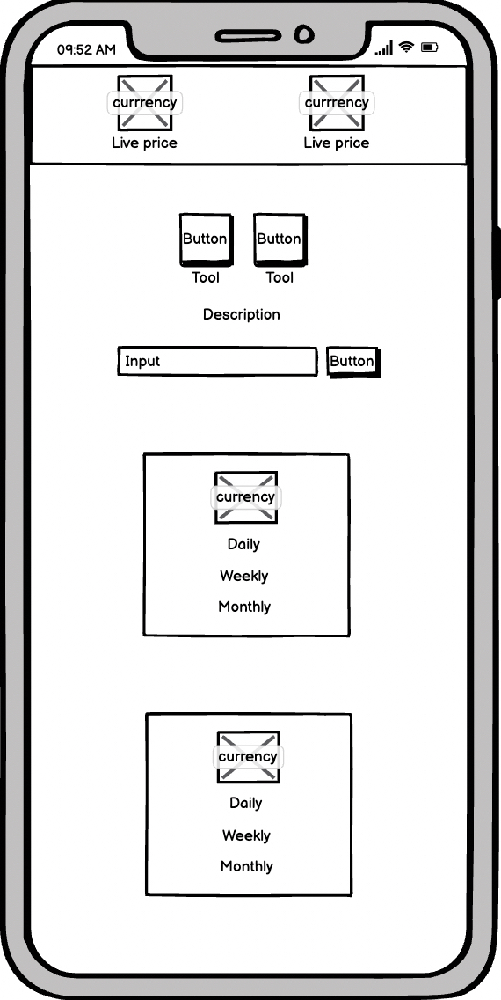

# The Surface Plane
## Design

### **Colour Scheme**
The main background colour is a gradient of the following colours (HEX) **#38393d**, **#252736**, **#333336**

The main website text is the colour “wheat”

All custom heading text is a deep shade of red #861142

### **Typography**
The main title/headings on this web application use a custom google font called 'Righteous' font while the rest of the websites content uses the 'Roboto' font.

### **Imagery**
The **AEHTER** image was taken from [RPLANET](https://rplanet.io)

The **WAX** & **USDT** images were taken from [Google](https://google.co.uk)

The custom tool icons for the mining power & elements were made by my graphics designer **'GNARLY'**

# Features

### **Currencies**

|  |  |  |
| :---: |  :---:  |  :---: |
| **AETHER** | **WAX** | **USDT** |

#### **There are three currencies used within this website:**
* **AETHER**
    * This is a game currency created by the developers at [RPLANET](https://rplanet.io), you can see a live price feed of this currency over at [Alcor](https://wax.alcor.exchange/trade/aether-e.rplanet_wax-eosio.token)
* **WAX** 
    * WAX (WAXP) is a purpose-built blockchain that is designed to make e-commerce transactions faster, simpler and safer for every party involved. You can see a live price feed of this currency over at [Coingekko](https://www.coingecko.com/en/coins/wax)
* **USDT** 
    * USDT is a stablecoin (stable-value cryptocurrency) that mirrors the price of the U.S. dollar, issued by a Hong Kong-based company Tether. The token’s peg to the USD is achieved via maintaining a sum of dollars in reserves that is equal to the number of USDT in circulation. You can see a live price feed of this currency over at [Coingekko](https://www.coingecko.com/en/coins/tether)

## Tools & Live prices
* **Live price feed**
    * A live price feed of both currencies used in throughout the web application, this displays both the **AEHTER** & **WAX** live prices updated every 10 seconds. The live price of Aether is taken from [Alcor Exchange](https://wax.alcor.exchange/trade/aether-e.rplanet_wax-eosio.token) using the [Alcor API](https://docs.alcor.exchange/developers-api). The live price of Wax is taken from the [Coingekko](https://www.coingecko.com/en/coins/wax) using the [Coingekko API](https://www.coingecko.com/en/api#explore-api)
    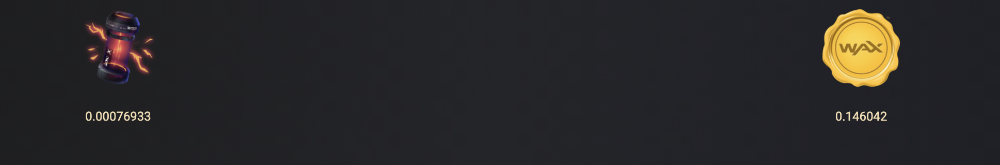

* **Tool selection**
    * A feature to allow users to easily change from the mining power calculator tool, to the elements tool
    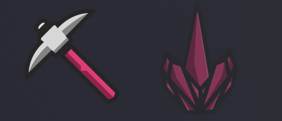

* **Mining tool**
    * A feature to allow users to calculate their **AETHER, WAX, USD** earnings which follows an algorithm based on the live prices
    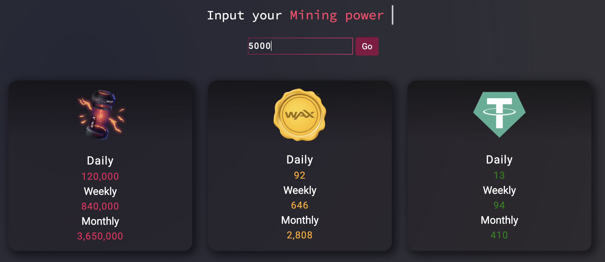

* **Elements tool**
    * A feature to allow users to search any existing element found on
    [RPLANET](https://rplanet.io/all_elements) and see the cost of that element from **AETHER** > **WAX** > **USD**
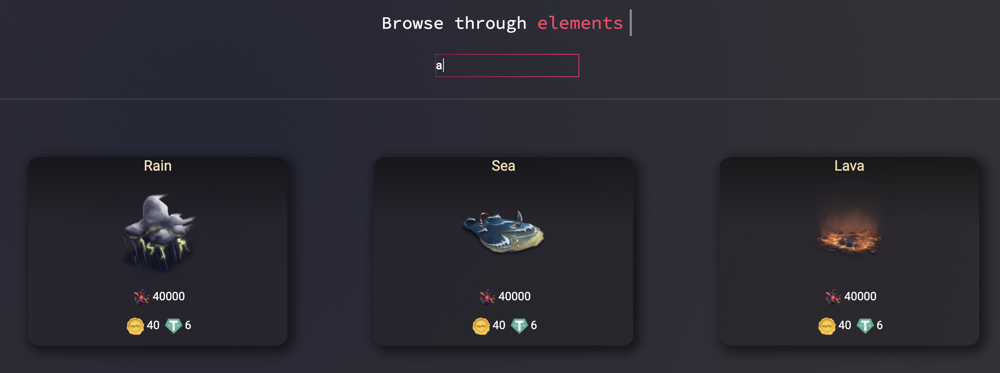

## Features Left to Implement
* **WAX Sign-in**
    * Allows users to login directly to their WAX account to pull their data automatically
* **Tool Automation**
    * Retrieve data from user account and base tool algorithms on user data

# Technologies

* [Alcor API](https://docs.alcor.exchange/developers-api)
    * This project uses the Alcor API to gather the live price of the **AETHER** currency used in this project.

* [Coingekko API](https://www.coingecko.com/en/api)
    * This project uses the Coingekko API to gather the live price of the **WAX & USDT** currencies used in this project.

* [CSS](https://en.wikipedia.org/wiki/CSS)
    * This project uses custom written CSS to style the Website.
* [Google Fonts](https://fonts.google.com) 
    * Google fonts are used throughout the project to import the Inter and Bevan fonts.
* [GitHub](https://github.com)
    * GitHub is the hosting site used to store the source code for the Website.

* [Git](https://git-scm.com/)
    * Git is used as version control software to commit and push code to the GitHub repository where the source code is stored.

* [Google Chrome Developer Tools](https://developer.chrome.com/docs/devtools/)
    * Google chromes built in developer tools are used to inspect page elements and help debug issues with the site layout and test different CSS styles.

* [balsamiq Wireframes](https://balsamiq.com/wireframes/)
    * This was used to create wireframes for 'The Skeleton Plane' stage of UX design.

# Testing

### Feature testing

| Test | Title | Process | Result | 
| ----------- | ----------- | ----------- | ------- | 
| T1 | Splash screen | The splash screen was first tested to ensure suitability and accuracy so that it responded well to all devices (mobile/tablet/desktop). Secondly the exit button was verified to ensure it takes the user to the homepage | Working as expected |
| T2 | Live API data | To test the live API data was working correctly any changes are monitored and reflected in the live price feed. This is expected to update every 10 seconds. |    |
| T3 | Tool selection buttons | The tool selectors were tested by switching between both tools multiples times to see if it would cause any damage or interference, after testing the tool selectors they proved sustainably effective. | 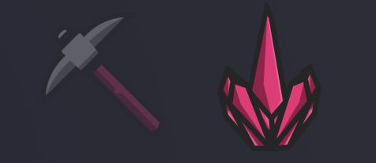 |
| T4 | Live API data (Error/offline) | To test the Live API data the API was purposely disconnected so the results were observable. In this case it will display "Offline" in the live price section to let the user know the servers are down and the tool cannot be used for this period.| 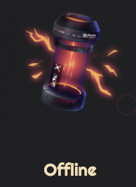 |
| T5 | Tool 1 - Mining power |The mining tool was tested by storing various data types into the input field. When a letter or a special character is inputted into the field the results return nothing as expected.| 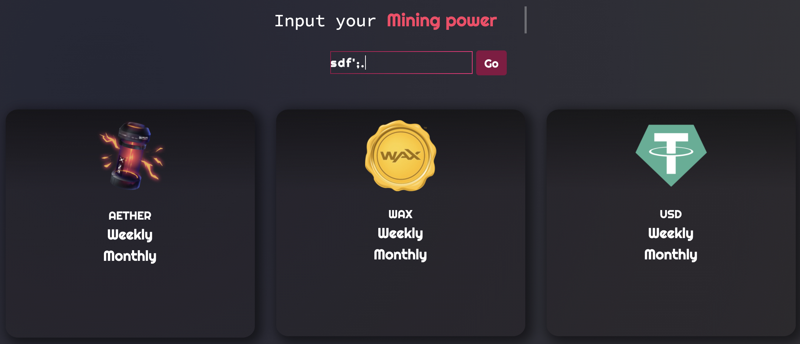 |
| T6 | Tool 2 - Elemental | To test the Elemental tool various letter inputs were altered to observe if they matched the elements within the database, subsequently an analysation of this test clearly represented no errors within this process. | 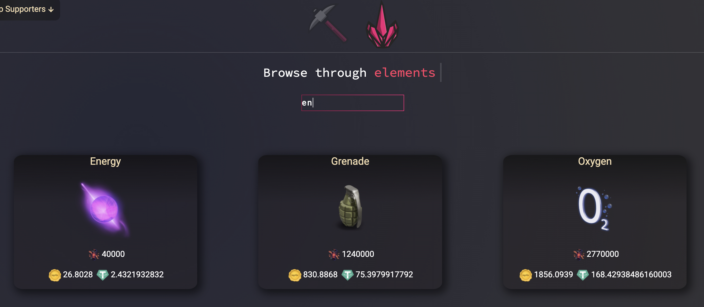 |
| T7 | Responsive design | To test the websites stability and ensuring it covers responsive design, the respective browser developer tools were used on the following browsers: Firefox, Chrome, IE & Safari and enabled the device viewer to allow change in the viewport. All browsers work well with all native devices (mobile/tablet/desktop)
(mobile/tablet/desktop) |  |
#### Validator Tests

* **HTML**
    * No errors were returned when passing the **index.html** file through the official [W3C validator](https://validator.w3.org)

        #### **index.html**

        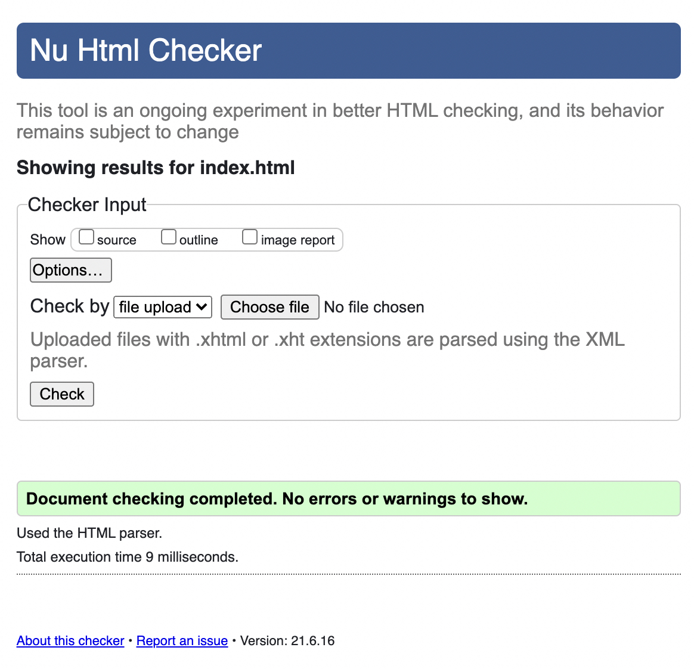
* **CSS**
    * All of the following files were passed through the official [Jigsaw validator](https://jigsaw.w3.org/css-validator)

        #### **main.css**

        

        #### **splash.css**

        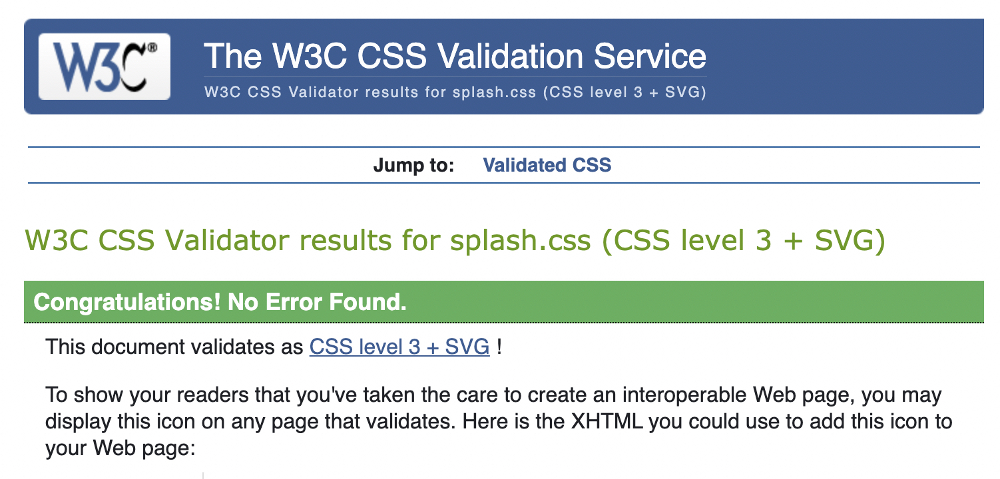

        
        #### **typewriter.css**

        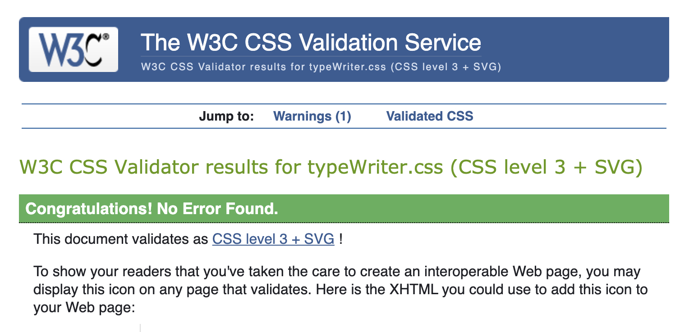

# Depolyment

#### To deploy this site locally follow the steps below:
* Click on the green 'code' button on the GamesDirect repository

* Select one of two options 'Download as ZIP', 'Open with GitHub Desktop'

**If 'Download as ZIP' has been chosen, follow the steps below:**

* Once the folder has been downloaded, un-ZIP the folder using a third-party application like WinZip, WinRAR

* Open the unzipped folder into your IDE (integrated development environment)

* For VSCode users, you can download the 'Live server' plugin and launch the project using a local server

* For users using any other IDE you will need to find out how to launch this project on the respective IDE

* Open your IDE of choice then open its terminal window (CLI) and locate the projects directory 

* Use the 'git clone' command in the terminal followed by the copied git URL

* A clone of the project will be created locally on your machine.

### Github pages

This site was deployed to GitHub pages. The steps to deploy are as follows:
* In the GitHub repository, navigate to the Settings tab
* From the source section drop-down menu, select the Master Branch
* Once the master branch has been selected, the page will be automatically refreshed with a detailed ribbon display to indicate the successful deployment.
* The live link can be found [here](https://somadevv.github.io/Rcalculator)

# Credits

* Currency images taken from [Google](https://google.co.uk)
* API Data was taken from [Alcor API](https://docs.alcor.exchange/developers-api) & [Coingekko](https://www.coingecko.com/en/api)

* The flex box CSS properties were used from [Stack overflow](https://stackoverflow.com/questions/44623821/how-to-use-flexbox)

#### Acknowledgements
* My mentor Spencer Baribell for his guidance throughout the project

* Mr Bim (Slack community member) helped write some of the algorithm logic in this project

* Gnarly (Close friend) helped with tool icon designs used in this project

